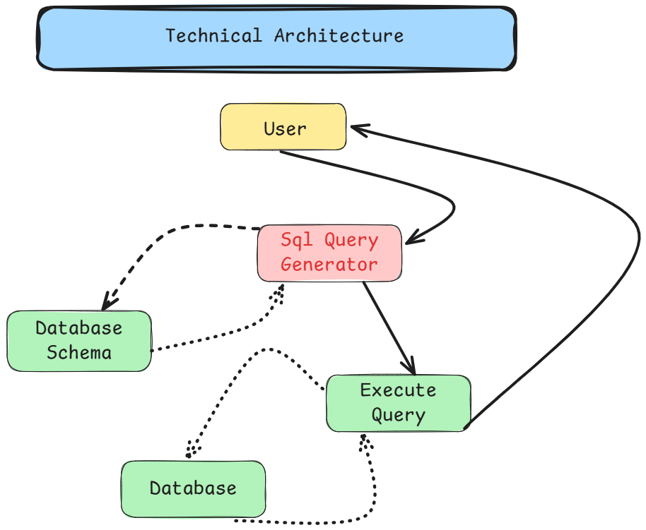

  

<h1 align="center">🦊 Data Fox — AI Text-to-SQL Engine</h1>

Transform natural language into executable SQL queries using LLM-powered intelligence.

---

# 🗺️ Project Development Roadmap

## 📌 Phase 1 — Project Initialization & Environment Setup

- ✅ Initialize Python project
- ✅ Configure virtual environment
- ✅ Manage dependencies with `uv`
- ✅ Define project folder structure
- ✅ Setup configuration files

---

## 🗄️ Phase 2 — Database Design & Data Preparation

- ✅ Create SQLite database
- ✅ Design relational tables (Customers, Orders, etc.)
- ✅ Define schema structure
- ✅ Populate database with dummy data for testing

---

## 🤖 Phase 3 — Core Application Development

- ✅ Extract database schema dynamically
- ✅ Implement Text-to-SQL engine  
  - Integrated **DeepSeek LLM via Ollama**
- ✅ Generate executable SQL queries
- ✅ Execute queries securely against database
- ✅ Build interactive frontend using Streamlit
- ✅ End-to-end testing and validation

---

## 🚀 Final Outcome

An AI-powered system that converts natural language queries into executable SQL statements and returns structured results through an intuitive web interface.
